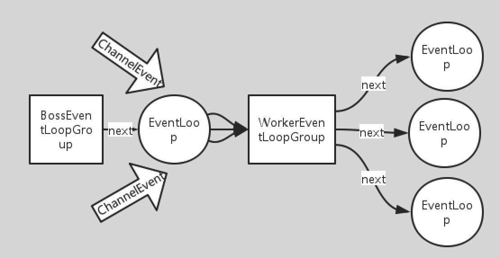

# ServerBootstrap(bootstrap:引导, boot:装入操作系统)
* Bootstrap sub-class which allows easy bootstrap of ServerChannel

```java
ServerBootstrap serverBootstrap = new ServerBootstrap();
serverBootstrap.channel(NioServerSocketChannel.class);
```

# ServerChannel
* A {@link Channel} that accepts an incoming connection attempt and creates
* its child {@link Channel}s by accepting them.  {@link ServerSocketChannel} is
* a good example.

# EventLoopGroup
* Special {@link EventExecutorGroup} which allows registering {@link Channel}s that get
* processed for later selection during the event loop.
* EventLoopGroup是一组EventLoop的抽象，由于Netty对Reactor模式进行了变种，实际上为更好的利用多核CPU资源，
Netty实例中一般会有多个EventLoop同时工作，每个EventLoop维护着一个Selector实例，类似单线程Reactor模式地工作着。
线程默认(核数*2)Runtime.getRuntime().availableProcessors() * 2
* 在Netty服务器编程中我们需要BossEventLoopGroup和WorkerEventLoopGroup两个EventLoopGroup来进行工作。
通常一个服务端口即一个ServerSocketChannel对应一个Selector和一个EventLoop线程，也就是我们建议BossEventLoopGroup的线程数参数这是为1。
BossEventLoop负责接收客户端的连接并将SocketChannel交给WorkerEventLoopGroup来进行IO处理.


* 如上图，BossEventLoopGroup通常是一个单线程的EventLoop，EventLoop维护着一个注册了ServerSocketChannel的Selector实例，BoosEventLoop不断轮询Selector将连接事件分离出来，通常是OP_ACCEPT事件，然后将accept得到的SocketChannel交给WorkerEventLoopGroup，WorkerEventLoopGroup会由next选择其中一个EventLoopGroup来将这个SocketChannel注册到其维护的Selector并对其后续的IO事件进行处理。在Reactor模式中BossEventLoopGroup主要是对多线程的扩展，而每个EventLoop的实现涵盖IO事件的分离，和分发（Dispatcher）。


